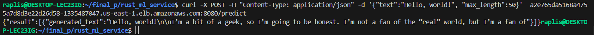
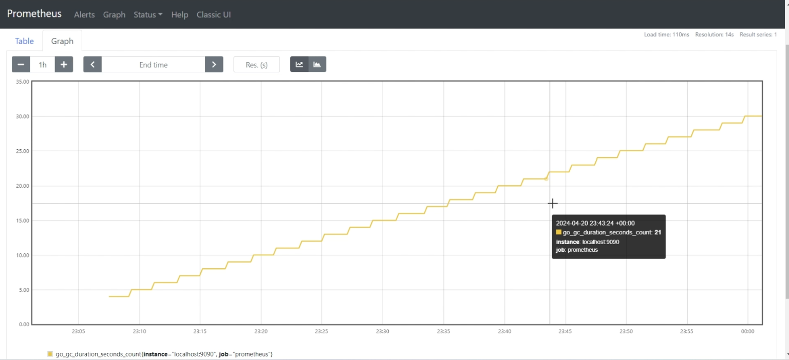

## LLMOps - Rust Machine Learning Model Serving

### Video Demonstration

Here is the link of our demo video: https://youtu.be/S6QLcIrv62U


### Project Background and Objectives

The goal of this project is to operationalize machine learning by developing a Rust web service to handle and respond to user data inference requests using an open-source machine learning model. We utilize Docker for containerizing our Rust application and manage scaling through Kubernetes. Additionally, the project integrates a CI/CD pipeline for automated code testing, building, and deployment, along with Prometheus for service monitoring and metrics collection to ensure stable service operations.

### Technology Stack

- **Rust**: A high-performance and memory-safe systems programming language.
- **Docker**: Supports containerized application development and runtime.
- **Kubernetes**: Container orchestration platform for automatic deployment, scaling, and management of containerized applications.
- **Prometheus**: Open-source monitoring and alerting toolkit for recording real-time service metrics.
- **GitHub Actions**: Automates workflows, from code testing to deployment.

### Project Structure

```
/rust_ml_service
    ├── src                  # Rust source code directory
    ├── Cargo.toml           # Rust project dependency configuration
    ├── Cargo.lock           # Dependency version lock file
    ├── Dockerfile           # Docker build file
    ├── k8s  # Kubernetes deployment configuration
    ├── prometheus.yml       # Prometheus monitoring configuration
    ├── app.py      		 # ML Model
    ├── .github/workflows    # cicd files
    └── README.md            # Project documentation
```

### Quick Start

The following steps guide you through cloning the project to running it.

#### Prerequisites

Ensure the following software is installed:

- Docker
- kubectl with Kubernetes cluster connection configured
- Rust environment (including Cargo)

### System Architecture and Component Functions

#### 1. Rust Web Service

This project's Rust web service handles all network requests, providing a high-performance HTTP interface for machine learning model inference requests. Key functionalities include:

- **Request Handling**: Utilizes the `actix-web` framework to receive and parse HTTP POST requests from users, optimizing asynchronous task handling for improved concurrency.
- **Data Validation**: Validates input data integrity through the `InputData` structure, ensuring each request contains the necessary `text` field and an optional `max_length` field.
- **Model Invocation**: Calls the local Python script `app.py` to perform machine learning inferences, using standard process invocation mechanisms (`std::process::Command`) to pass parameters and initiate the Python environment.
- **Response Generation**: Parses the JSON output returned by the Python script and packages it into the `Prediction` structure, returning it to the client in JSON format.
- **Error Handling**: Captures and handles all potential execution errors, ensuring clients receive appropriate error responses.

#### 2. Python Text Generation

The Python component is responsible for loading pre-trained machine learning models and generating text based on inputs. It uses the `transformers` library, with specific functions as follows:

- **Model Loading**: Utilizes the `transformers` library's `pipeline` feature to load the `EleutherAI/gpt-neo-125M` model, which is specialized for text generation tasks.
- **Text Generation**: Generates continuation text based on parameters received from the Rust service, handling text generation according to the provided `max_length`.
- **Exception Management**: Handles and responds to various exceptions that may occur during text generation, such as model loading failures or generation process errors.

#### 3. Workflow

- Users send text data through the POST request to the `/predict` endpoint.
- The Rust web service receives the request, validates the data, and invokes the Python script.
- The Python script performs the text generation task and returns the results to the Rust service.
- The Rust service formats the results and sends them back to the client.
- Any errors along the way are captured and returned to the user with appropriate HTTP status codes and error messages.

#### Step 1: Clone Project Repository

Clone the code repository and enter the project directory:

```
git clone git@github.com:raplis/finalproj.git
cd finalproj
```

#### Step 2: Build Docker Image

Build a Docker image containing the Rust application:

```
docker build -t rust_ml_service .
```

#### Step 3: Deploy to Kubernetes

Deploy the service and configurations to your Kubernetes cluster using kubectl:

```
kubectl apply -f k8s/deployment.yaml
kubectl apply -f k8s/service.yaml
```


#### Step 4: Access the Service

Use the following command to view the external IP of the service:

```
kubectl get services
```

Access your service using the returned IP address, you can use browser open the IP:8080 to use the LLM service(here I use curl as an example):



And you can use IP:9090 to access the prometheus to monitor your service:




### CI/CD Automated Deployment

In this project, we utilize GitHub Actions to implement Continuous Integration (CI) and Continuous Deployment (CD). Below are the detailed steps and configuration guides to ensure automated testing, building, and deployment to the Kubernetes cluster upon every code commit.

#### GitHub Actions Configuration Steps

1. **Create Workflow File**: In the project's `.github/workflows` directory, create a new YAML file `cicd.yml`.

2. **Define Trigger Conditions**: Set conditions for triggering the workflow, typically on push and pull request events to the main branch.

   ```
   name:  Build and Deploy
   
   on:
     push:
       branches: master
     pull_request:
       branches: master
   ```

3. **Define Workflow Jobs**:

   - **Setup Environment**: Specify the virtual environment to run the workflow.

     ```
     jobs:
       build:
         runs-on: ubuntu-latest
     ```

   - **Checkout Code**: Use actions/checkout@v2 to checkout your repository code.

     ```
     steps:
     - uses: actions/checkout@v2
     ```

   - **Build and Push Docker Image**: Build the Docker image and push it to Docker Hub or another container registry.

     ```
     - name: Build and push Docker image
       uses: docker/build-push-action@v2
       with:
       context: .
       file: ./Dockerfile
       push: true
       tags: raplis/rust_ml_service:latest
     ```
   
   - **Deploy to Kubernetes**: Update the service in the Kubernetes cluster with the newly built Docker image.
   
     ```
     - name: Deploy to Kubernetes
       run: |
         ssh-add <(echo "$SSH_KEY")
     
         # Disable SSH host key checking
         mkdir -p ~/.ssh
         echo -e "Host *\n\tStrictHostKeyChecking no\n\n" > ~/.ssh/config
     
         ssh $USER@$HOST "kubectl apply -f k8s/deployment.yaml && \
         kubectl apply -f k8s/service.yaml && \
         sleep 40 && \
         kubectl get services"
     ```
   
   - **Run Tests**: Execute integration tests to ensure that code changes do not break existing functionalities.
   
     ```
     - name: Run tests
       run: |
         cargo test
     ```

#### Monitoring and Logging

To monitor the performance and stability of the Rust machine learning service, we will use Prometheus to collect essential operational data.

1. **Configure Prometheus**: Add monitoring targets in the Prometheus configuration file `prometheus.yml`, specifying the Rust service's metric endpoint.

   ```
   scrape_configs:
     - job_name: 'rust_ml_service'
       static_configs:
         - targets: ['rust-ml_service:8080']
   ```

2. **Collect Key Metrics**: Configure the Rust app to expose metrics such as response times and request volumes through the `/metrics` endpoint.

3. **View and Analyze Data**: Use Prometheus's built-in expression browser or Grafana for data visualization, reviewing historical and real-time performance data.

4. **Configure Alerts**: Use Prometheus's Alertmanager to set up alerting rules to send notifications when specific metrics exceed normal ranges.

   ```
   alerting:
     alertmanagers:
       - static_configs:
           - targets: ['localhost:9093']
   rule_files:
     - "alert_rules.yml"
   ```
   ```
   groups:
   
     - name: example
       rules:
       - alert: HighRequestLatency
         expr: job:request_latency_seconds:mean5m{job="rust_ml_service"} > 0.5
         for: 10m
         labels:
           severity: page
         annotations:
           summary: High request latency of Rust ML Service

